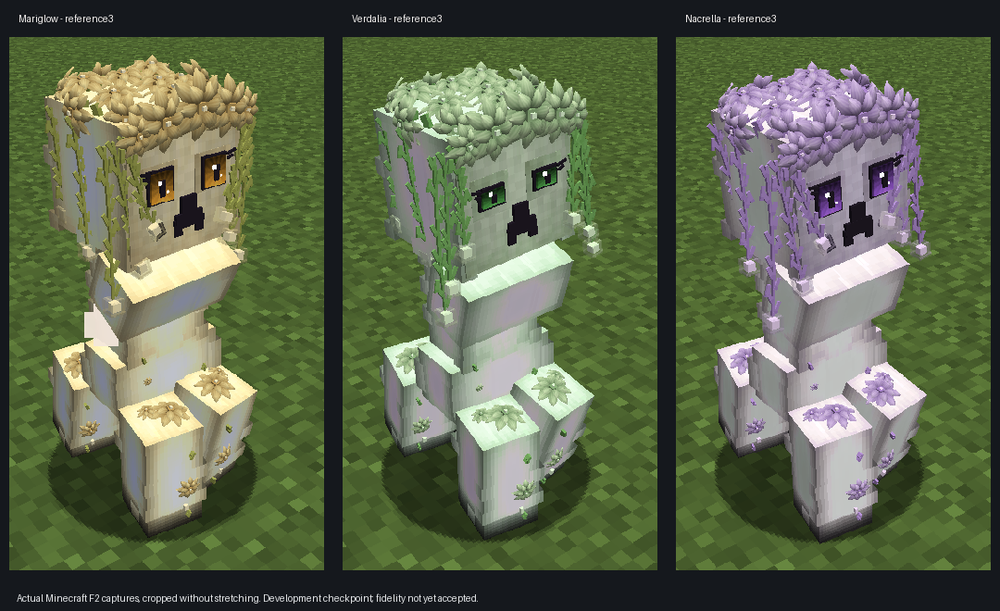

# 🌸 Bloom & Boom

A botanical Minecraft Forge project where Creepers become living floral variants with themed identities, Bloom Bursts, and a long-term ReBloom lifecycle vision.



*Actual cropped Minecraft Forge development-client captures of reference3. Visual fidelity remains under review.*

## 🌱 Project Identity

**Bloom & Boom** is the official project and display name.

Legacy internal registry/save identifiers remain preserved unless a tested migration is explicitly required.

The tested development source, JAR and QA evidence were delivered privately to the owner. Public bundle publication, a browsable source-tree import and a stable release remain open. See [the current reconstruction checkpoint](docs/REFERENCE3.md) for exact hashes and remaining gates.

---

## ✨ Features & Design Goals

Existing Creeperella lineage features include:

- 🌺 Floral Creeper variants with unique identities
- 💥 Themed Bloom Burst architecture
- 💣 Demolition Buddies
- 🍬 Treat interactions
- 🎵 Fuse Whistle behavior
- 🔄 Reusable blasts and reform systems
- 💾 Transform and save-state preservation

Future ReBloom extensions:

- lifecycle progression systems
- deeper companion mechanics
- additional variant evolution paths

The approved design direction keeps a centralized themed burst system instead of creating disconnected explosion implementations.

---

## 📊 Current Status

| Area | Status |
| --- | --- |
| Project | Bloom & Boom |
| Minecraft target | 1.20.1 |
| Forge target | 47.4.23 |
| Stable lineage | Creeperella 1.5.0 |
| Verified development lineage | Creeperella 1.6.0-dev6+ |
| Latest local candidate | 1.6.0-dev7-polish39-reference3; development preview, not a stable release |
| Build status | Java 17 / Gradle 8.8 offline build and reobfuscation passed |
| Native Minecraft QA | Three Froglight native views, night/charged checks, ten-family dedicated-server spawn and saved-companion loading passed |

---

## 🧪 Verification Status

Latest reference3 passed its build, exact-JAR server and focused native-client checks. Curved petals, Pie-driven eyes and the charged overlay repair are implemented. **Exact concept-art fidelity remains unaccepted.** [Review the evidence and remaining gates](docs/REFERENCE3.md).

Historical verified checkpoints:

- Forge build and production dedicated-server startup passed for the recovered baseline and inputfix1.
- Native development client displayed all ten family variants and saved/reloaded a transformed companion.
- inputfix1 repairs double-hand empty-click toggles and synchronizes companion ownership to the client while keeping legacy save identifiers.
- visual1 was an earlier texture experiment. Its generated material direction was superseded after recovering the original reference instructions; it is not an approved fidelity target.
- The visual1 offline build, resource graph, UV/glow contracts, and 712 sampled animation formula checks passed. Actual in-game visual captures were taken.

Still open: full gameplay/compatibility coverage, sound testing with a complete official asset cache, authenticated multiplayer, and importing the recovered source as a browsable repository tree. The current source is included in the privately delivered checkpoint bundle. Development bundles are review candidates, not a stable release. See the [wiki](https://github.com/Herbertofury/Bloom-and-Boom/wiki) for bounded checkpoint notes.


---

## 🛠 Building

A reproducible Forge development environment is required.

Typical command once dependencies and Gradle tooling are available:

```bash
gradle --offline --no-daemon clean build
```

Offline builds require prepopulated Gradle/Minecraft dependencies.

---

## 📚 Documentation

- [Project Status](docs/STATUS.md)
- [Roadmap](docs/ROADMAP.md)
- [Build & Testing](docs/BUILD-AND-TESTING.md)

---

## 🗺 Roadmap

### Current priorities

- [ ] Restore complete reproducible build workflow
- [ ] Validate dev7 candidate through real Forge build
- [ ] Complete ReBloom lifecycle implementation
- [ ] Expand Shroomboom/Froglight family systems
- [ ] Add Cow Creeper variant
- [ ] Establish release verification pipeline

### Completed direction

- [x] Bloom & Boom identity established
- [x] Creeperella variant roadmap created
- [x] Centralized Bloom Burst direction defined

---

## 🤝 Contributions

Please preserve:

- Bloom & Boom identity
- existing registry/save compatibility
- existing variant behavior
- visual consistency

Changes should include evidence of testing where possible.
