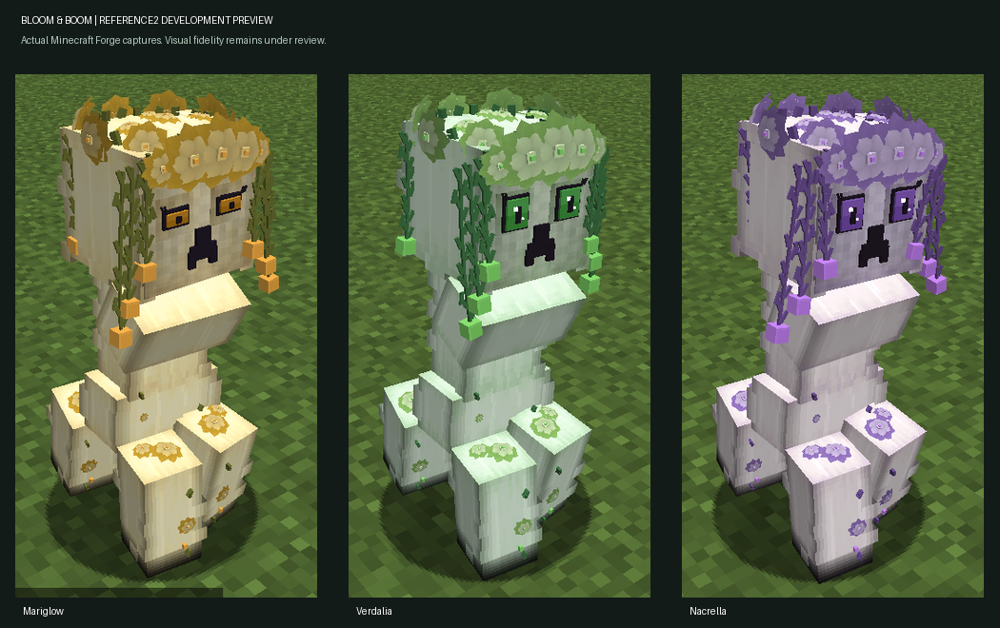

# Froglight reference reconstruction

## Latest reference2 checkpoint — 7 October 2026

**Development candidate, not an accepted stable release or exact concept-art match.** The official name is Bloom & Boom; the internal `creeperella` save identity is preserved.

The source/JAR/QA development bundle was delivered privately to the owner. Public bundle publication is pending explicit approval.

### What changed

- Mariglow, Verdalia and Nacrella follow the approved clean Froglight references. No new AI-generated reference or material images were used for reference2; the earlier visual1 generated-texture pass is not an accepted fidelity target.
- Curved petal surfaces replace rectangular flower petals, with a full-head crown, roof flowers, ten articulated hanging chains and foot flowers.
- Reference eye geometry uses existing Pie blink/gaze channels. Body, chest and animation lineage remain intact.
- Refined body/face materials, shaded soles and tinted lanterns. Charged-state native QA exposed a white overlay hiding the textures; Froglight-only sparse tinted charge masks fix that issue without changing Cat's charge route.
- Original art was reconciled into 62 distinct images / 63 encodings, with approved targets, special states, baseline, inspiration, rejected history and pixel-identical duplicates kept distinct. The owner received a searchable comparison gallery.

### Verified evidence

- Java 17 / Gradle 8.8 build and production reobfuscation passed for Minecraft 1.20.1 / Forge 47.4.23.
- Exact JAR: **486,850 bytes**, SHA256 `37e7c9514d241b83d2f7c9b8439b107fb6d9e68e9e8097a125c0f680c5271565`.
- Exact packaged JAR passed isolated dedicated-server startup, ten-family spawn, saved-companion load, world save and exit-zero checks.
- Real development-client captures cover all three Froglights, Mariglow night, and the charged-overlay repair. The client saved and exited cleanly. These are native captures, not concept art or offline renders.
- Static checks passed for 25 protected assets, unchanged Cat animation, 712 sampled Pie formula evaluations, reference eye-channel reuse, UV/glow contracts, charged-mask coverage and companion input/owner-sync guards. All 21 packaged Froglight material images match the tested source bytes.
- Bundle: **7,293,921 bytes**, SHA256 `a81d55c488ec53f95f733efb967da5aeb497a42a6eae594b7c3a694c76facf83`.

### Remaining gates

Flower volume, face/lash detail and literal reference resemblance remain below the acceptance target. More angles, motion and production-client tests are needed, alongside broader gameplay/save compatibility and authenticated multiplayer. The cloud QA setup has an incomplete official Minecraft asset cache and earlier slow-tick/UI-timeout warnings; sound/panorama coverage and performance claims remain unverified.

The recovered source is available in the development bundle delivered to the owner. Public source publication, a normal browsable source-tree import and stable release publication remain open. Historical sections below describe their original checkpoints only.

Minecraft Dev Kit now has [hash-pinned reference selection and pixel-duplicate checks](https://github.com/Herbertofury/Agent-Foundry/blob/main/skills/minecraft-dev-kit/scripts/reference_catalog.py), with ten focused self-tests and a [reference-authority guide](https://github.com/Herbertofury/Agent-Foundry/blob/main/skills/minecraft-dev-kit/references/reference-exact-reconstruction.md). Catalog/build success does not substitute for visual acceptance.

---

